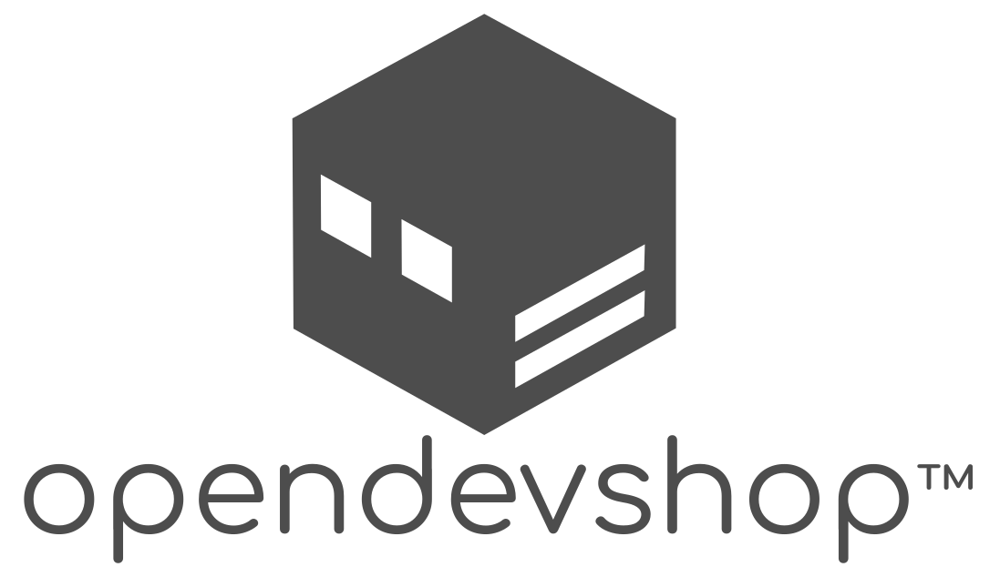

[DevShop][1] is an **Open Source DevOps Framework** and a 
set of reusable **components** designed to improve the web development, testing, and 
server management process, especially for [Drupal](https://drupal.org) websites.

The goal of DevShop is to provide a complete **web development & testing pipeline** out of the
box, while empowering users to choose their own server infrastructure and systems 
architecture.
 
DevShop uses [Ansible & Ansible Galaxy][2] for server configuration, [Symfony 
Console][3] for command line tools, and [Drupal][3] for the web interface.

## Core Values

#### Empower and Liberate.
  - Empower site builders with a feature complete, fully open source platform.
  - Liberate site owners by granting them the freedom to choose their own infrastructure and architecture.

#### Simplify and Demystify.
  - Simplify the management of complex systems by defining core building blocks and designing components that work independently of the platform.
  - Demystify computing by maintaining configuration for the entire vertical stack, down to Linux and services, all the way up to container management platforms, hyper

#### Collaborate & Engage.
  - Collaborate with developers and systems administrators to build a product that fits their needs first.
  - Engage the community to work together towards the common goal of  a complete OpenOps platform and healthy ecosystem of tools.

#### Lower Costs & Barriers
  - Lower the cost of running sites with a host-agnostic platform, commoditizing servers, and moving maintenance costs of DevOps tools off of organizations and on to the community, 
  - Lower the barriers of entry into the DevOps world for all.

## DevShop Components

The DevShop Components are small, independently functional tools that are all designed to work together.

These tools are designed to be useful regardless of the hosting or DevOps systems they are being run on. 

### Composer Packages

#### [DevShop Control](src/DevShop/Control) & [DevShop Control Project](src/DevShop/Component/ControlProject)

> Drupal CI/CD Dashboard and Ansible Server Manager in a Box

- Web-based front-end for a DevShop server. Drupal 7 based. 
- Add unlimited Drupal projects and environments per server.
- Create and configure servers all through the web interface.
- DevShop Control is built into the devshop codebase. The DevShop Control Project is a composer project template that can be used to deploy a custom devshop control site.

#### [Deploy](./src/DevShop/Component/Deploy)

> One command, many stages for flexible CI per environment.

- Single `deploy` command to be used in CI systems designed to encompass the entire cycle: git updates, code build, reinstall, deploy hooks and test.
- Options and pre-sets allow users to skip or include stages depending on the environment. For example, `--skip-reinstall` can be used on a demo site to prevent destroying the content.
- Configure each "stage" in `composer.json`, to easily customize commands for each site. For example, to import config or not.

#### [YamlTasks](./src/DevShop/Component/YamlTasks)

> Simple test runner with GitHub API integration.

- Keep tests and standard commands in a Yaml file.
- Run all commands with a single command.
- Send command results to GitHub as Commit Statuses, to ensure Quality Control and present feedback to developers via pass/fail results on Pull Request pages.

#### [PowerProcess](./src/DevShop/Component/PowerProcess)

> Run commands with standard beautiful output.

- Enhanced Symfony Process component for improved user experience and log portability.
- Improved command-line user experience, metadata reporting (executed time, PID, logs).
- Pluggable output through monologger: pipe to screen, file, or remote monologger compatible REST API.

#### [GitHub API CLI](./src/DevShop/Component/GitHubApiCli)

> Simple abstract CLI for interacting with the GitHub API.

- Simple CLI wrapper for the GitHub API, where every API resource is a command and options are automatically passed. 
- "Deploy" command provides simple way to interact with GitHub's Deployments API using composer commands and bin scripts.

#### [Git Traits](./src/DevShop/Component/GitTraits)

> Traits and classes for accessing Git, GitHub and Composer Data.

- `GitRepositoryAwareTrait`: Add to any class to read info from the current Git Repository.
- `GitHubRepositoryAwareTrait`: Repository functionality plus a helper methods like `getRepoOwner()`.
- `ComposerRepositoryAwareTrait`: Repository functionality plus accessors for getting data from `composer.json`.

#### [GitSplit](./src/DevShop/Component/YamlTasks)

> Split a monorepo with a single command.

- Commands to split the git monorepo into multiple child repos. 
- Uses the same [splitsh-lite]() script that Symfony and Drupal uses.
- Reads list of repositories from `composer.json` config.
    
### Ansible Roles

See https://galaxy.ansible.com/opendevshop for all roles.

1. opendevshop.apache
2. opendevshop.devmaster
3. opendevshop.users
4. devshop.server - All in one devshop server.

### Docker Containers

- [devshop/server](https://hub.docker.com/r/devshop/server) All in one container, uses systemd to run all services.

As we progress forward with the Ansible and Docker system, more common web services will be created and released as Ansible Roles and Docker containers.
 
# Resources

* [Documentation](http://docs.opendevshop.com) Please Contribute! [github.com/opendevshop/documentation](https://github.com/opendevshop/documentation) 
* [Chat](http://gitter.im/opendevshop/devshop) on Gitter: [gitter.im/opendevshop/devshop](http://gitter.im/opendevshop/devshop)
* [Issue Queue](http://github.com/opendevshop/devshop/issues) on GitHub: [github.com/opendevshop/devshop/issues](http://github.com/opendevshop/devshop/issues)
* [Development Information](http://docs.opendevshop.com/development.html)  Developer documentation will walk you through contributing to DevShop.
* [OpenDevShop.com](http://www.opendevshop.com): Company website.
* [Follow us on Twitter](http://twitter.com/opendevshop)

# About DevShop

Version | Status | Aegir | Hosts      | Status
--------|--------|-------|------------|----------
1.x     | Stable | 3.x   | D6, D7, D8 | 

  

DevShop is a "cloud hosting" system for Drupal. DevShop makes it easy to host, develop, test, and update drupal sites.  It provides a front-end built in Drupal ([Devmaster](https://github.com/opendevshop/devmaster)) and a back-end built with Drush, Symfony, and Ansible.

DevShop deploys your sites using git, and allows you to create unlimited environments for each site.  DevShop makes it very easy to deploy any branch or tag to each environment

Code is deployed on push to your git repo automatically.  Data (the database and files) can be deployed between environments.  Run the built-in hooks whenever code or data is deployed, or write your own.

# Built on Aegir

DevShop utilizes the main components of the Aegir Hosting System: [Hosting](http://drupal.org/project/hosting) and [Provision](http://drupal.org/project/provision). It does not use [Hostmaster](http://drupal.org/project/hostmaster); it uses its own installation profile, [Devmaster](http://github.com/opendevshop/devmaster).  It does not use the theme, Eldir.  The default DevShop theme is called [Boots](https://github.com/opendevshop/devmaster/tree/7.x-1.x/themes/boots) and is included in the Devmaster install profile.

DevShop uses many additional contributed modules that Aegir core does not.

# Aegir Cooperative Founding Member

OpenDevShop Inc is a founding member of the Aegir Cooperative.  Lead DevShop developer Jon Pugh is a core Aegir maintainer.  

See [aegir.coop](http://aegir.coop) for more information.

# Tour

See the [Tour](http://docs.opendevshop.com/tour.html) section of the documentation for a quick walk-through of the DevShop interface.

# Support

* Bug reports and feature requests should be reported in the [DevShop Issue Queue](https://www.github.com/opendevshop/devshop/issues).
* Ask for help in the [Chat Room](http://gitter.im/opendevshop/devshop).

## Contributors

This project exists thanks to all the people who contribute. 

## Backers

Thank you to all our backers! 🙏 [[Become a backer](https://opencollective.com/devshop#backer)]

## Sponsors

Support this project by becoming a sponsor. Your logo will show up here with a link to your website. [[Become a sponsor](https://opencollective.com/devshop#sponsor)]

For the full list of Backers and Sponsors, see [BACKERS.md](BACKERS.md)

# License

DevShop is licensed under [GPL v2](https://www.gnu.org/licenses/old-licenses/gpl-2.0.txt).

This means any forks of this code must be released as open source and also be licensed under the GPL.

# Help Improve Documentation

For full documentation on DevShop, visit [docs.opendevshop.com](http://docs.opendevshop.com) or see our git repository [github.com/opendevshop/documentation](https://github.com/opendevshop/documentation).

Think this can be improved? You can [Fork our Documentation on GitHub](https://github.com/opendevshop/documentation)!

Thanks!

[1]: https://getdevshop.com
[2]: https://galaxy.ansible.com
[3]: https://github.com/jonpugh/director
