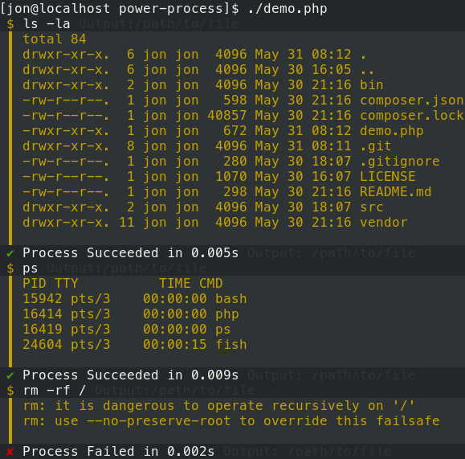

# Power Process

This library provides an upgraded Symfony Process component.

It gives a more user friendly interface for apps that want to show users what processes are running and what their output is.

This library is used by Provision Yaml Tests and will be used in the Provision CLI project.

## Usage

Usage extends the [Symfony Process](https://symfony.com/doc/current/components/process.html) component.

See [demo.php](demo.php) for a simple demo:

```php
// Include autoloader
include('vendor/autoload.php');

// PowerProcess needs IO.
$input = new \Symfony\Component\Console\Input\ArgvInput($argv);
$output = new \Symfony\Component\Console\Output\ConsoleOutput();

// Replace Style with your own to change the output style.
$io = new ProvisionOps\Tools\Style($input, $output);

// Run any command.
$command = 'ls -la';
$process = new ProvisionOps\Tools\PowerProcess($command, $io);
$process->run();
```

Then run the file:

```bash
php demo.php
```

You will see the commands running like so:



## Another Example

The file [`run'](run) is a wrapper for any command. 

Try:

```bash
./run ping packagist.org -c 5
./run git status
./run rm -rf /
```

Simple.

## Functionality

This project is being extracted from Provision CLI. It will grow and change rapidly.

Planned functionality:

- [x] Format output for human readability.
- [ ] Automatically pipe output to files, with options for destination path. (This is already done in Provision CLI)
- [ ] Allow easily silencing output.
- [ ] Add hooks to allow other plugins to react to process events.
