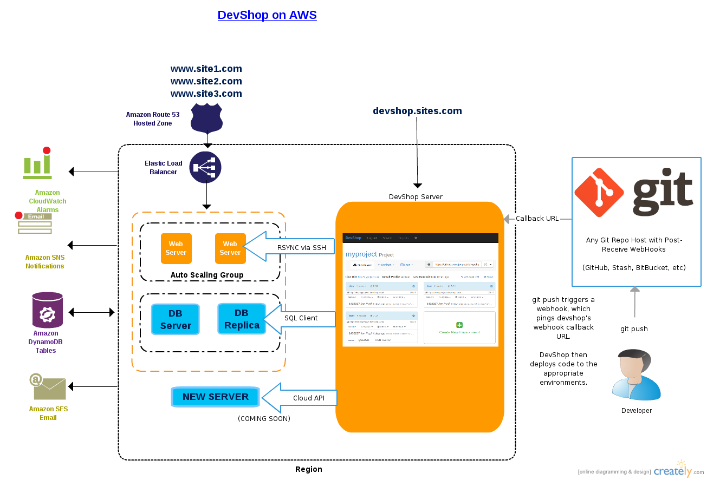

# Setup Examples

There are many ways to use devshop.

This file will outline the different ways you can use devshop to deploy and manage your own cloud hosting infrastructure.

## Single Server

If you are only hosting a handful of sites, devshop can run on a single server. 2GB is usually enough unless you want to use Solr as well, then 4GB is the minimum for reasonable performance.

Any developers that you wish to grant access to the sites on this server will have full access to the devshop front-end as well.

## Multiple Servers

Larger websites with more significant traffic should keep the devshop server on a separate machine than the live sites.

Other servers \(called "remotes"\) can then be connected to the devshop server via ssh.

Once connected, aegir is able to set the apache configuration and create mysql databases on the remote servers.

DevShop will then receive deploy commands and rsync the code to the remote servers automatically.

Each remote server can have one or many services on it. You can connect a server with apache, mysql, and solr, or you can use separate servers for apache and mysql.

Additional web servers can be connected in a "cluster" or a "pack". This is a feature of Aegir. See [http://community.aegirproject.org/content/web-clusters](http://community.aegirproject.org/content/web-clusters) for more information on this configuration.

NOTE: Remote servers must be setup and configured manually, for now. Work is progressing to make installation of remote servers fully automatic. See [Remote servers \(multiserver\)](http://community.aegirproject.org/node/30) and [Remote webserver configuration](http://community.aegirproject.org/node/396) for more information on aegir remote servers.

## Amazon Web Services Example

[Network Diagram for DevShop on AWS on creately](https://creately.com/diagram/i8bky9y71/1ZGBJkfo7bjh1fidQYCKFjJ89D8%3D)

