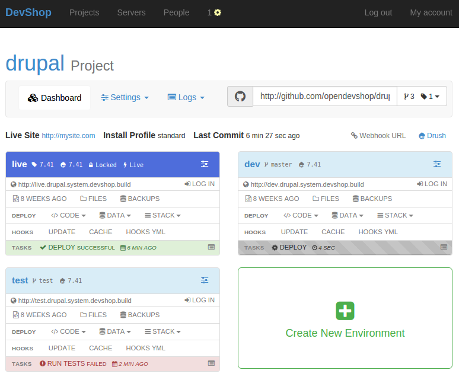

# About DevShop

## DevShop



## Resources

* [Documentation](http://docs.opendevshop.com) Please Contribute! [github.com/opendevshop/documentation](https://github.com/opendevshop/documentation) 
* [Chat](http://gitter.im/opendevshop/devshop) on Gitter: [gitter.im/opendevshop/devshop](http://gitter.im/opendevshop/devshop)
* [Issue Queue](http://github.com/opendevshop/devshop/issues) on GitHub: [github.com/opendevshop/devshop/issues](http://github.com/opendevshop/devshop/issues)
* [Development Information](http://docs.opendevshop.com/development.html)  Developer documentation will walk you through contributing to DevShop.
* [OpenDevShop.com](http://www.opendevshop.com): Company website.
* [Follow us on Twitter](http://twitter.com/opendevshop)

## About Devshop

| Version | Status | Aegir | Hosts | DevMaster | Install & CLI |
| :--- | :--- | :--- | :--- | :--- | :--- |
| 1.x | Stable | 3.x | D6,D7,D8 |  |  |

DevShop is a "cloud hosting" system for Drupal. DevShop makes it easy to host, develop, test and update drupal sites. It provides a front-end built in Drupal \([Devmaster](http://github.com/devshop/devmaster)\) and a back-end built with drush, Symfony, and Ansible.

DevShop deploys your sites using git, and allows you to create unlimited environments for each site. DevShop makes it very easy to deploy any branch or tag to each environment

Code is deployed on push to your git repo automatically. Deploy any branch or tag to any environment. Data \(the database and files\) can be deployed between environments. Run the built-in hooks whenever code or data is deployed, or write your own.

## Built on Aegir

DevShop utilizes the main components of the Aegir Hosting System: [Hosting](http://drupal.org/project/hosting) and [Provision](http://drupal.org/project/provision). It does not use [Hostmaster](http://drupal.org/project/hostmaster), it's own installation profile, [Devmaster](http://github.com/opendevshop/devmaster). It does not use the theme, Eldir. The default devshop theme is called [boots](https://github.com/opendevshop/devmaster/tree/1.x/themes/boots) and is included in the Devmaster install profile.

DevShop uses many additional [contributed modules](https://github.com/opendevshop/documentation/tree/533364047546c8a893bb1cb43640441dddce5adc/drupal-contributions.md) that Aegir core does not.

## Aegir Cooperative Founding Member

OpenDevShop Inc is a founding member of the Aegir Cooperative. Lead DevShop developer Jon Pugh is a core Aegir maintainer.

See [aegir.coop](http://aegir.coop) for more information.

## Tour

See the [Tour](tour.md) section of the documentation for a quick walkthrough of the DevShop interface.

## Components

DevShop currenly consists of four main components:

**DevShop**

DevShop core.

* \(github.com/opendevshop/devshop\)\[[https://github.com/opendevshop/devshop](https://github.com/opendevshop/devshop)\]
* Install scripts.
* Vagrantfile, Dockerfiles, docker-compose.yml file.
* Behat Tests.
* Issue Queue
* DevShop CLI

**Devmaster**

DevShop Front-End. A Drupal 7 website.

* [github.com/opendevshop/devmaster](https://github.com/opendevshop/devmaster)
* An install profile and makefile.
* DevShop Drupal modules

**Aegir & DevShop Ansible Galaxy Roles**

DevShop installs using Ansible Galaxy roles that we maintain. See [galaxy.ansible.com/opendevshop/](https://galaxy.ansible.com/opendevshop) for the full list of available roles.

These roles extend the excellent [Ansible roles provided by Jeff Geerling](http://galaxy.ansible.com/geerlingguy):

* geerlingguy.mysql
* geerlingguy.apache
* geerlingguy.php
* geerlingguy.php-mysql
* geerlingguy.drush
* geerlingguy.composer

### Support

* Bug reports and feature requests should be reported in the [Drupal DevShop Issue Queue](https://www.drupal.org/project/issues/devshop).
* Join \#devshop on IRC.

### Installation

See [the installation instructions](../install-and-upgrade/installing-devshop.md) for detailed information on installing DevShop.

### Usage

Using devshop is a lot like using aegir.

Visit [http://devshop.local](http://devshop.local) or your chosen domain in the browser to view the front-end.

SSH into your server as the `aegir` user to access the back-end.

Use drush to access any of your sites. Use `drush sa` to see the list of available aliases.

### Vagrant

There is now a vagrantfile for DevShop that makes for an easy way to test it out and to contribute to the development of DevShop.

It is included in this package. To use, clone this repo and vagrant up.

#### Vagrant Development Mode

By default, vagrant development mode is on. This is set in `vars.yml`:

```text
# Set development to FALSE if you wish to test a "clean" devshop install.
vagrant_development: true
```

If vagrant development is set to TRUE, then the script `vagrant-prepare-host.sh` is run on the first call to `vagrant up`.

This script requires drush and git to be installed on the host, so that we can build devmaster and clone the repos locally.

The source files are cloned into the `/source` folder in this repo, which is mounted inside the vagrant box. Once up and running, you can edit any files in the `/source` folder and it will be immediately visible in the VM.

### Testing

Very rudimentary testing is happening on TravisCI at [http://travisci.org/opendevshop/devshop](http://travisci.org/opendevshop/devshop)

TravisCI tests on Ubuntu 14.04, therefor 14.04 is the most supported.

The install script is tested on:

* ubuntu 14.04
* centos 7.0

### License

DevShop is licensed under [GPL v2](https://www.gnu.org/licenses/old-licenses/gpl-2.0.txt).

This means any forks of this code must be released as open source and also be licensed under the GPL.

### Help Improve Documentation

Think this can be improved? You can [edit this file on GitHub](https://github.com/opendevshop/devshop/edit/1.x/README.md) and select "Create a new branch for this commit and start a pull request.".

Thanks!

