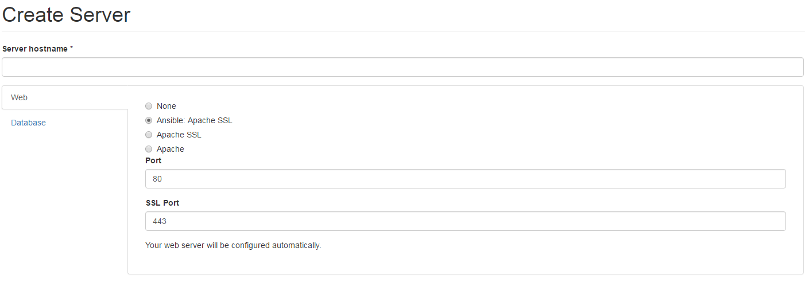
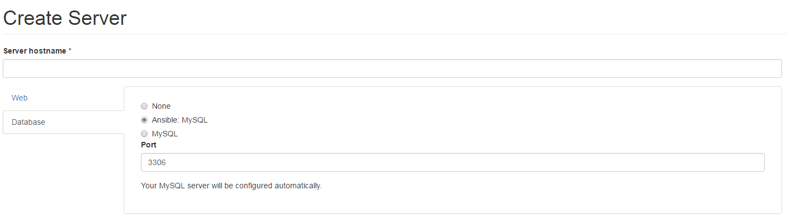

# Remote Servers

We have created a module that will set up remote servers from within the GUI. The following steps are the current process needed to set up a remote.

First set up the remote host to allow access from the master server

1. SSH onto the remote host
2. Sudo to the root user  `sudo su` 
3. Create a ~/.ssh folder for root `mkdir ~/.ssh` 
4. Add your master server's public key to the known hosts  `echo "your_key" >> ~/.ssh/authorized_keys`
5. Disable SELinux \(bad I know but this module is still experimental\) `setenforce 0` 

Now log onto the master server

1. SSH onto the master server
2. Go to the modules area of your aegir hostmaster or devshop site. `cd /var/aegir/devmaster-1.x/sites/HOSTNAME/modules/`
3. Download the new modules `git clone http://github.com/opendevshop/aegir_ansible /var/aegir/hostmaster-7.x-3.x/sites/HOSTNAME/modules`
4. Copy the `inventory` file to `/etc/ansible/hosts` and make it executable \(as `root`, or use sudo. Note `aegir` user cannot sudo.\):

   ```text
    `root@local:~# cp /var/aegir/hostmaster-7.x-3.x/sites/HOSTNAME/modules/aegir_ansible/inventory /etc/ansible/hosts`
    `root@local:~# chmod +x /etc/ansible/hosts`
   ```

5. Enable the required modules `drush @hostmaster en ansible_services aegir_ansible_inventory` 

Now you can use the GUI to provision a host`*`

Log into your opendevshop host and choose servers -&gt; add server \(or visit [http://your.fqdn.here/node/add/server](http://your.fqdn.here/node/add/server)\)

In the web section will be a new option labelled "Ansible: Apache SSL". Select this option 

In the Database section will be a new option labelled "Ansible: MySQL". Select this option 

Click save, then run the verify task. Watch the log as it progresses and you should see the server install all the required Apache and MySQL code and configuration. If the verification succeeds, you have a new remote host up and synced into Aegir.

`*` = The GUI will partially provision a host... It has issues with SELinux and granting the MySQL database access from the master server.

