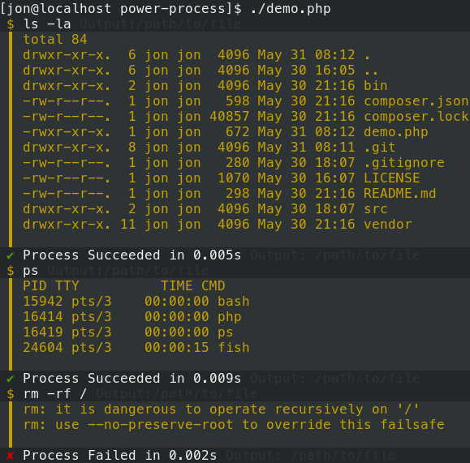

# Power Process

This library provides an upgraded Symfony Process component.

It gives a more user friendly interface for apps that want to show users what processes are running and what their output is.

This library is used by Provision Yaml Tests and will be used in the Provision CLI project.

## Symfony 4	

The Symfony Process component has different typehints in the parameters of several APIs in Symfony 4 than Symfony 3 does. This is due to the fact that Symfony 4 requires PHP 7.1.3 or later, which supports a number of typehints not permitted in earlier PHP versions. This difference is minor for most clients, but presents problems for code that subclasses Process, as it is not possible to be compatible with both the Symofny 3 and the Symfony 4 typehints at the same time.	

| PowerProcess Branch | Symfony Versions | PHP Versions
| ------------ | ---------------- | ------------
| master (1.x) | ^2 \| ^3         | 5.6+

NOTE: A Symfony 4 compatible component will be released at some point.

*Big thanks to @g1a and the consolidation team for this block of text, and setting an example of a Process-based component.*

See https://github.com/consolidation/site-process/compare/2.x...master as an example on maintaining 2 branches.

## Usage

Usage extends the [Symfony Process](https://symfony.com/doc/current/components/process.html) component.

See [demo.php](demo.php) for a simple demo:

```php
// Include autoloader
include('vendor/autoload.php');

// PowerProcess needs IO.
$input = new \Symfony\Component\Console\Input\ArgvInput($argv);
$output = new \Symfony\Component\Console\Output\ConsoleOutput();

// Replace Style with your own to change the output style.
$io = new DevShop\Component\PowerProcess\PowerProcessStyle($input, $output);

// Run any command.
$command = 'ls -la';
$process = new DevShop\Component\PowerProcess\PowerProcess($command, $io);
$process->run();
```

Then run the file:

```bash
php demo.php
```

You will see the commands running like so:



## Another Example

The file [`run'](run) is a wrapper for any command. 

Try:

```bash
./run ping packagist.org -c 5
./run git status
./run rm -rf /
```

Simple.

## Functionality

This project is being extracted from Provision CLI. It will grow and change rapidly.

Planned functionality:

- [x] Format output for human readability.
- [ ] Automatically pipe output to files, with options for destination path. (This is already done in Provision CLI)
- [ ] Allow easily silencing output.
- [ ] Add hooks to allow other plugins to react to process events.
